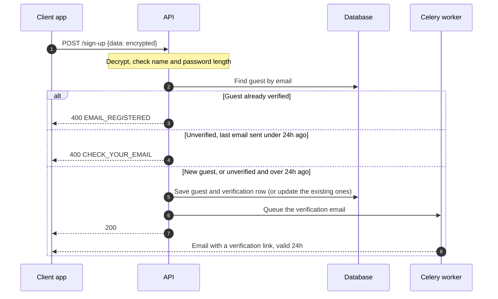
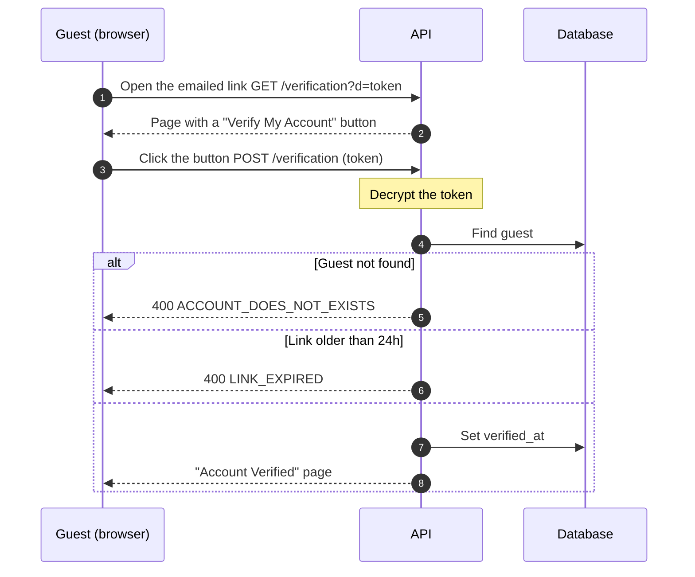
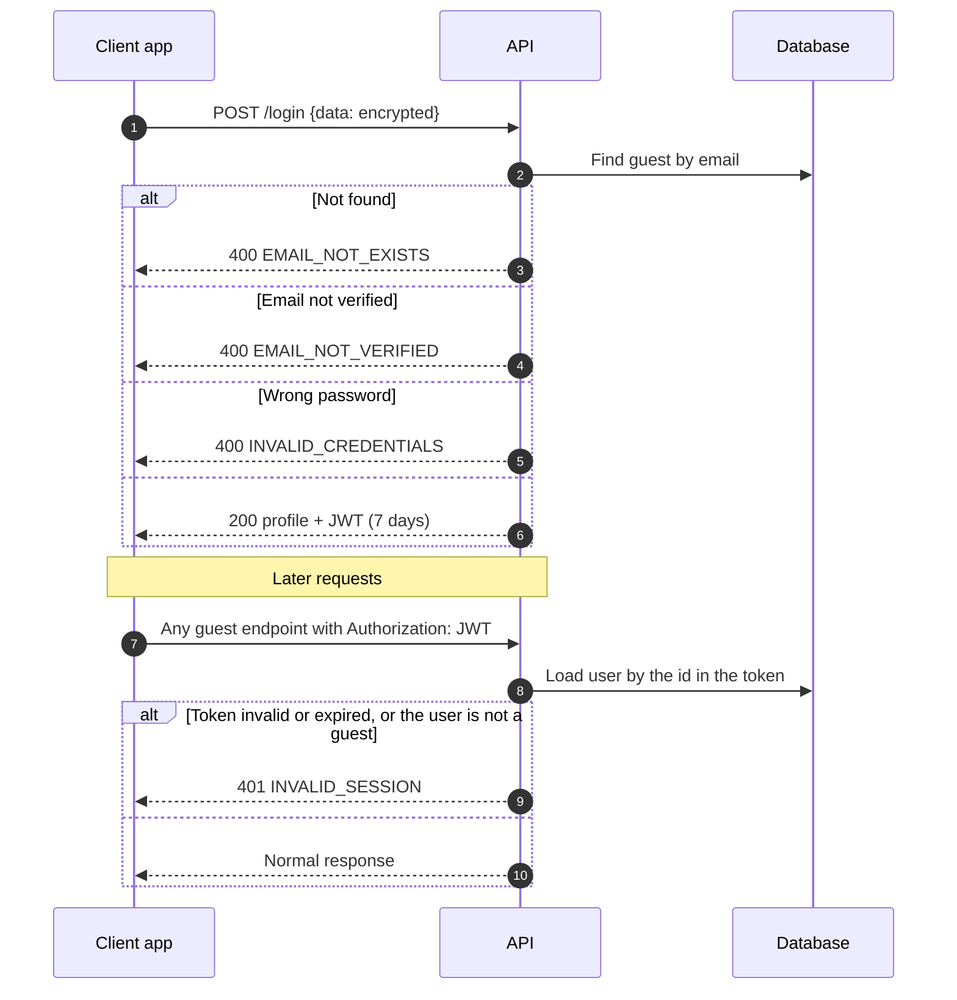
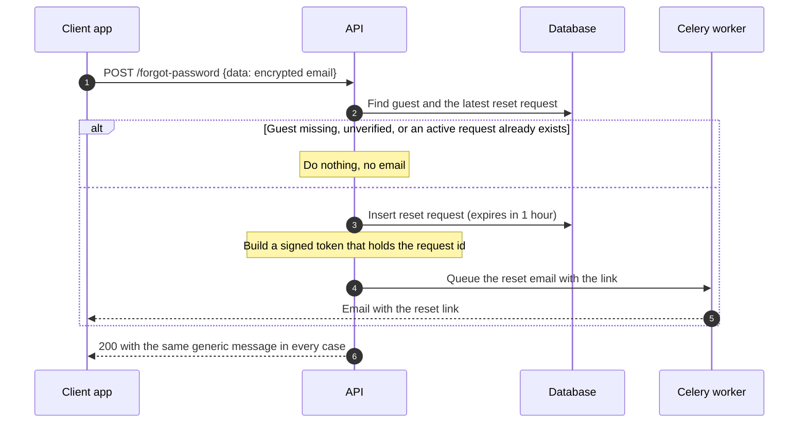
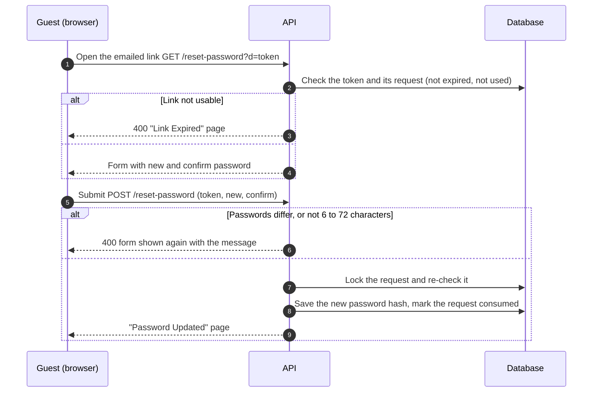

# Guest · Auth

How a guest signs up, logs in and recovers a password. Routes are under `/<STAGE>/api/v1/guest/auth` (see `/docs` for request shapes).

## Key ideas

- **Encrypted credentials.** Sign up, login and forgot password send `{"data": "<encrypted>"}`, encrypted with AES-256-GCM (`SecurePayloadHandler`, key `COZI_ENCRYPTION_KEY`). The verify and reset pages are plain HTML forms.
- **Stateless JWT.** Login returns a 7-day token (`TOKEN_SECRET_KEY`) that the client sends in the `Authorization` header. Logout just means the client drops it.
- **Emails go through Celery.** The API only queues `send_email_task`. A worker sends the email over SMTP, so a running worker is required.
- **Passwords** are bcrypt-hashed and must be 6 to 72 characters (sign up and reset).

## 1. Sign up

## 2. Email verification

## 3. Login and using the token

## 4. Forgot password

The same response for every case is what stops the endpoint from revealing which emails are registered.

## 5. Reset password

The token is signed with a key derived from `TOKEN_SECRET_KEY` and only holds the request id, so it can never be used as a login token. The database row decides if the link is expired or used, so each link works once.

## Data

`users` (ULID id, email, `user_type`, hashed password) is the base table. `guests` extends it with name and phone (SQLAlchemy joined inheritance). Related tables: `guest_verifications`, `guest_password_reset_requests`.

## Where things are

| What | Where |
| --- | --- |
| Routes and services | `src/domains/guest/auth/` |
| DTOs and validators | `src/domains/guest/dtos/sign_up_login_dto.py` |
| Error names (`{"detail": "<NAME>"}`) | `src/domains/guest/enums.py` |
| Models | `src/core/models/guest*.py`, `user.py` |
| Encryption and tokens | `src/core/services/` (`secure_payload_handler.py`, `auth_token_handler.py`, `password_reset_token_handler.py`) |
| Pages and emails | `src/templates/` |
| Tests (need Docker) | `tests/domains/guest/auth/` |

Env vars: `STAGE`, `DB_URL`, `TOKEN_SECRET_KEY`, `COZI_ENCRYPTION_KEY`, `SMTP_*`, `RABBITMQ_URL`, and optionally `API_BASE_URL` (base of the reset link).

## Known limitations

- A malformed encrypted payload returns `500` instead of `400`.
- Login and sign up reveal whether an email is registered. Only forgot password hides it.
- Login tokens are not revoked after a password reset.
- `otel_handler` redacts the query and body of `/auth/reset-password`, so the token and password are not logged. Serve that page over HTTPS in production.
