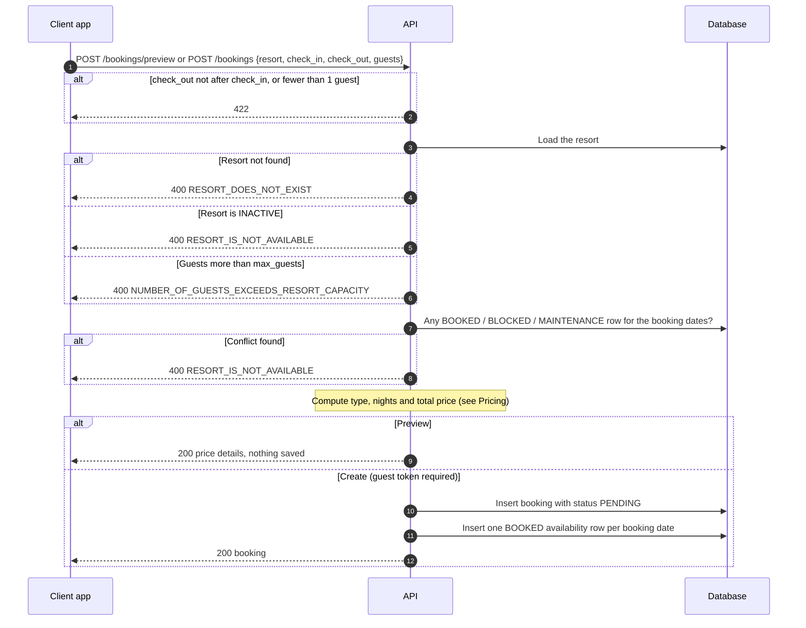
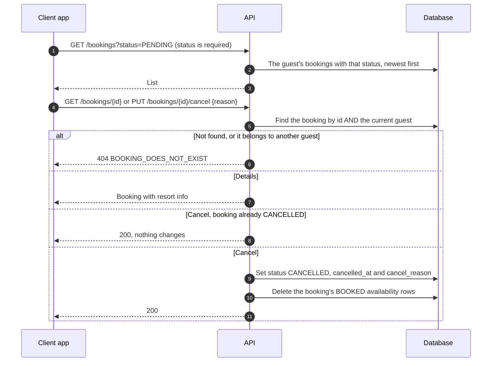

# Guest · Booking

How a guest previews, books, views and cancels a stay. Routes are under `/<STAGE>/api/v1/guest/bookings` (see `/docs` for request shapes). Everything needs a guest token except the preview.

## 1. Preview and create a booking

The preview and the create call run the same checks. The preview stops before saving anything.

The booking and its availability rows are saved in one commit, so a booking never exists without its blocked dates.

### Which dates a booking blocks

| Booking | Dates blocked |
| --- | --- |
| Overnight, e.g. check in 10 Jan, check out 12 Jan | 10 Jan and 11 Jan. The check out date stays free, so the next guests can arrive on 12 Jan |
| Day use (same check in and check out date) | That one date |

The same dates are used for the conflict check and for blocking (`get_booking_dates`).

## 2. View and cancel

Cancelling frees the dates, so they can be booked again straight away.

## Pricing

| Duration (check_out - check_in) | Type | Price |
| --- | --- | --- |
| 12 hours or less | `day_use` | `base_price_per_day_use` |
| More than 12 hours | `overnight` | `base_price_per_night × ceil(hours / 24)` |

## Rules worth knowing

- Send timezone-aware datetimes. They are stored in UTC and most responses show Asia/Manila time.
- New bookings are `PENDING`, and cancelling sets `CANCELLED`. `CONFIRMED`, `COMPLETED` and `EXPIRED` exist but nothing in the guest API sets them yet.
- A cancelled booking is listed under `status=CANCELLED`, not under `PENDING`.
- The `payments` table (PayMongo) exists but is not connected to bookings.

## Where things are

| What | Where |
| --- | --- |
| Routes and services | `src/domains/guest/booking/` |
| Shared checks | `src/domains/guest/booking/services/` (resort, capacity, availability, price) |
| Models | `src/core/models/booking.py`, `resort_availability.py`, `payments.py` |
| Tests (need Docker) | `tests/domains/guest/booking/` |

## Known limitations

- Two requests for the same dates at the same moment can both pass the availability check, because the database has no unique constraint on `(resort_id, date)`. Adding one (with a migration, and turning the resulting error into a `400`) would close this.
- A `PENDING` booking holds its dates and nothing expires it yet, so unpaid bookings keep the dates blocked until they are cancelled.
