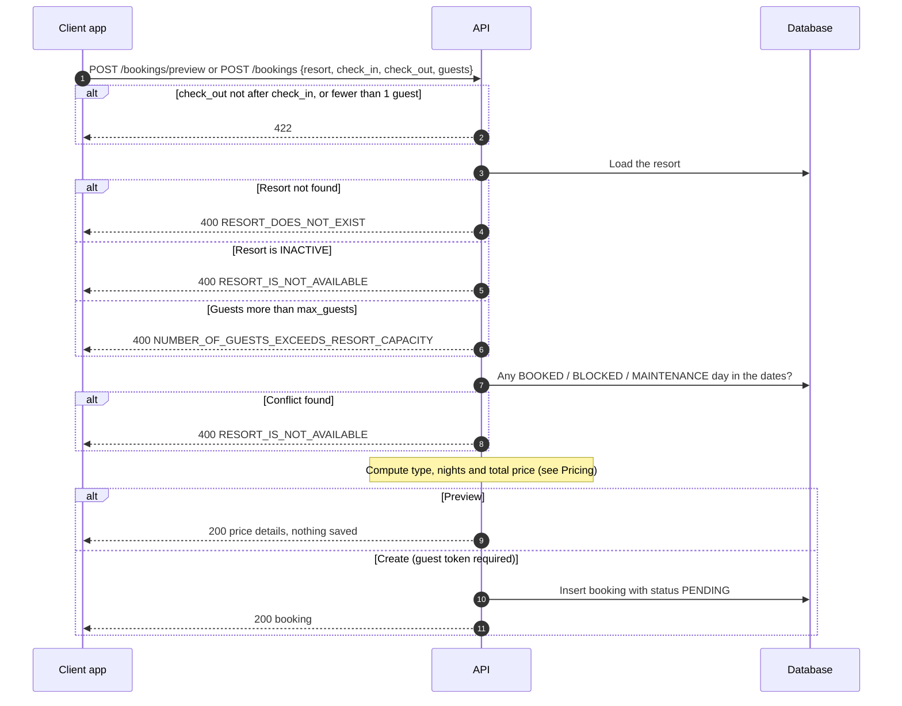
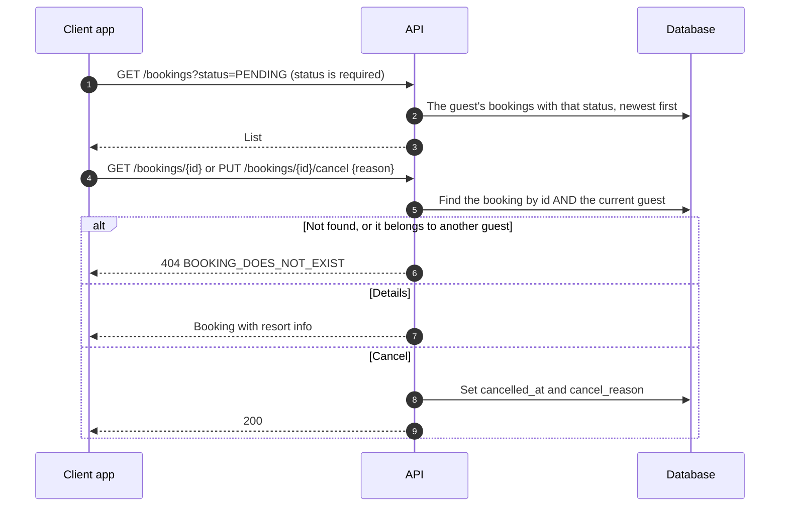

# Guest · Booking

How a guest previews, books, views and cancels a stay. Routes are under `/<STAGE>/api/v1/guest/bookings` (see `/docs` for request shapes). Everything needs a guest token except the preview.

## 1. Preview and create a booking

The preview and the create call run the same checks. The preview stops before saving anything.

## 2. View and cancel

## Pricing

| Duration (check_out - check_in) | Type | Price |
| --- | --- | --- |
| 12 hours or less | `day_use` | `base_price_per_day_use` |
| More than 12 hours | `overnight` | `base_price_per_night × ceil(hours / 24)` |

## Rules worth knowing

- Send timezone-aware datetimes. They are stored in UTC and most responses show Asia/Manila time.
- New bookings are `PENDING`. `CONFIRMED`, `COMPLETED`, `CANCELLED` and `EXPIRED` exist but nothing in the guest API sets them yet.
- The `payments` table (PayMongo) exists but is not connected to bookings.

## Where things are

| What | Where |
| --- | --- |
| Routes and services | `src/domains/guest/booking/` |
| Shared checks | `src/domains/guest/booking/services/` (resort, capacity, availability, price) |
| Models | `src/core/models/booking.py`, `resort_availability.py`, `payments.py` |
| Tests (need Docker) | `tests/domains/guest/booking/` |

## Known limitations

- Creating a booking does **not** write availability rows, so the same dates can be booked twice.
- Cancelling only sets `cancelled_at`. The status stays `PENDING`, so a cancelled booking still shows in the `PENDING` history, and nothing frees the dates.
- A day-use booking on a single date never conflicts, because the availability date range is empty.
