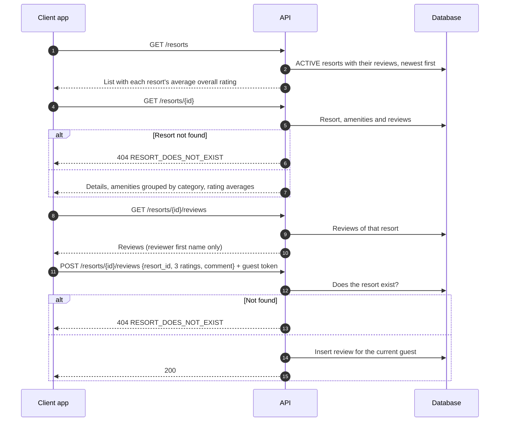

# Guest · Resort

How a guest browses resorts and reads or writes reviews. Routes are under `/<STAGE>/api/v1/guest/resorts` (see `/docs` for request shapes). Reading is public. Posting a review needs a guest token.

## Browse and review

## Rules worth knowing

- The list only shows `ACTIVE` resorts. Details and reviews work for any resort id.
- Ratings are whole numbers (overall, cleanliness, value). Details returns their averages, or zeros when there are no reviews.
- Amenity categories: `POOL`, `ENTERTAINMENT`, `DINING`, `UTILITIES`.
- Resort statuses: `ACTIVE`, `INACTIVE`, `MAINTENANCE`. Only `INACTIVE` blocks booking (see [Booking](Booking.md)).

## Where things are

| What | Where |
| --- | --- |
| Routes and services | `src/domains/guest/resort/` |
| Models | `src/core/models/resort.py`, `resort_amenity.py`, `resort_review.py` |
| Tests (need Docker) | `tests/domains/guest/resort/` |

## Known limitations

- **`GET /resorts` returns `500`** if an active resort has no reviews, because the average divides by zero. Details handles this case, the list does not.
- The review body carries `resort_id` and that value is used, not the one in the URL.
- Ratings are not range-checked, and a guest can review the same resort many times, or without having stayed there.
- The details response leaves out `latitude`, `longitude` and `base_price_per_day_use`.
