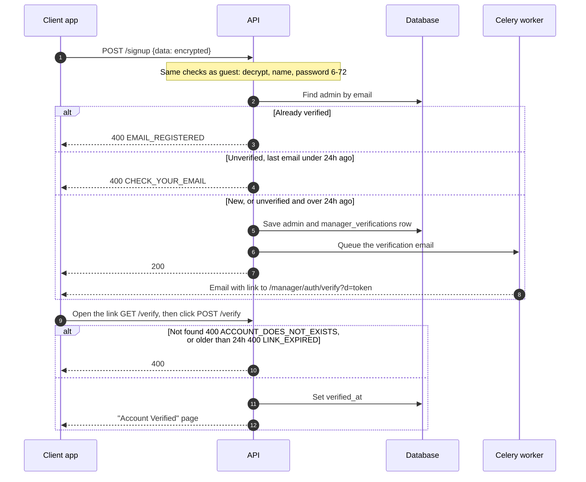
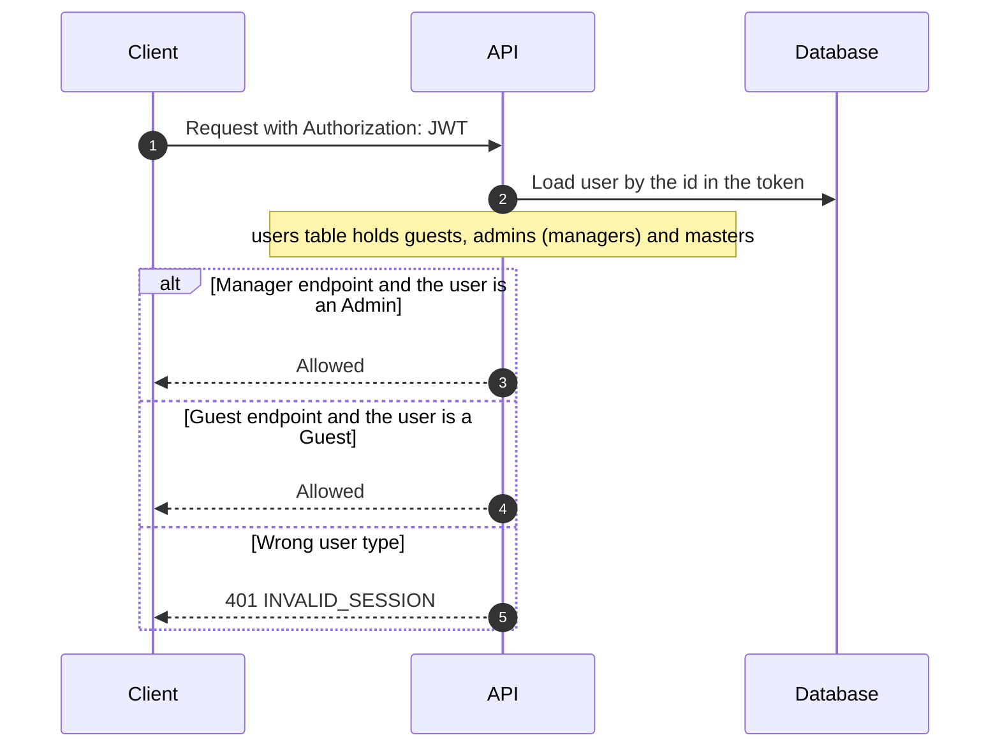

# Manager · Auth

How a manager signs up and logs in. A **manager is an admin**: the person who owns or manages **one resort**. The code calls them `Admin`, the API calls them `manager`. Routes are under `/<STAGE>/api/v1/manager/auth`.

The flow is a copy of the guest one. See [Guest · Auth](../Guest/Auth.md) for encrypted payloads, tokens and emails. Only the differences are here.

## Differences from guest

| Topic | Guest | Manager |
| --- | --- | --- |
| Paths | `/sign-up`, `/verification` | `/signup`, `/verify` |
| Tables | `guests`, `guest_verifications` | `admins`, `manager_verifications` |
| Login response id | `guest_id` | `manager_id` |
| Logout | Only needs the header | Also checks the token belongs to a manager |
| Forgot / reset password | Yes | Not built yet |

A new manager has no resort yet. `organization_id` and `resort_id` on `admins` stay empty until the manager adds a resort.

## 1. Sign up and verify

Login works like guest login and returns `manager_id`, the name and a 7-day JWT.

## 2. Guest and manager tokens are separate

All user types share the `users` table (SQLAlchemy joined inheritance, chosen by `user_type`):

| `user_type` | Model | Meaning |
| --- | --- | --- |
| `guest` | `Guest` | Books resorts |
| `admin` | `Admin` | Manager of a single resort |
| `master` | `Master` | Owns multiple resorts with an admin in each (mapped, no endpoints yet) |

## Where things are

| What | Where |
| --- | --- |
| Routes and services | `src/domains/manager/auth/` |
| Error names | `src/domains/manager/enums.py` (plus the shared `INVALID_NAME`, `INVALID_PASSWORD_LENGTH`) |
| Models | `src/core/models/admin.py`, `manager_verification.py`, `master.py` |
| Manager token check | `AutoManagerUser` in `src/core/services/auto_user.py` |
| Tests (need Docker) | `tests/domains/manager/auth/` |

## Not built yet

Forgot/reset password for managers, master auth, creating a resort, and foreign keys from `admins.resort_id` and `organization_id` to `resorts` and `organizations`.
