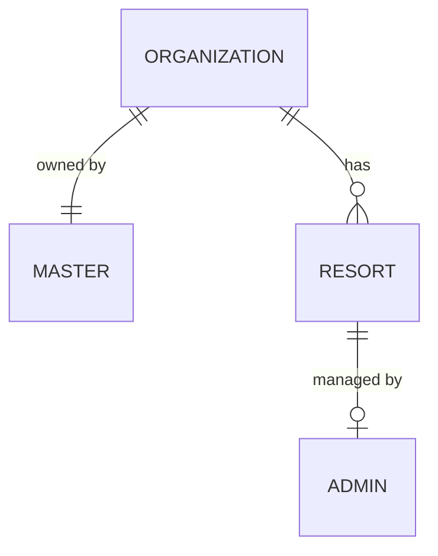
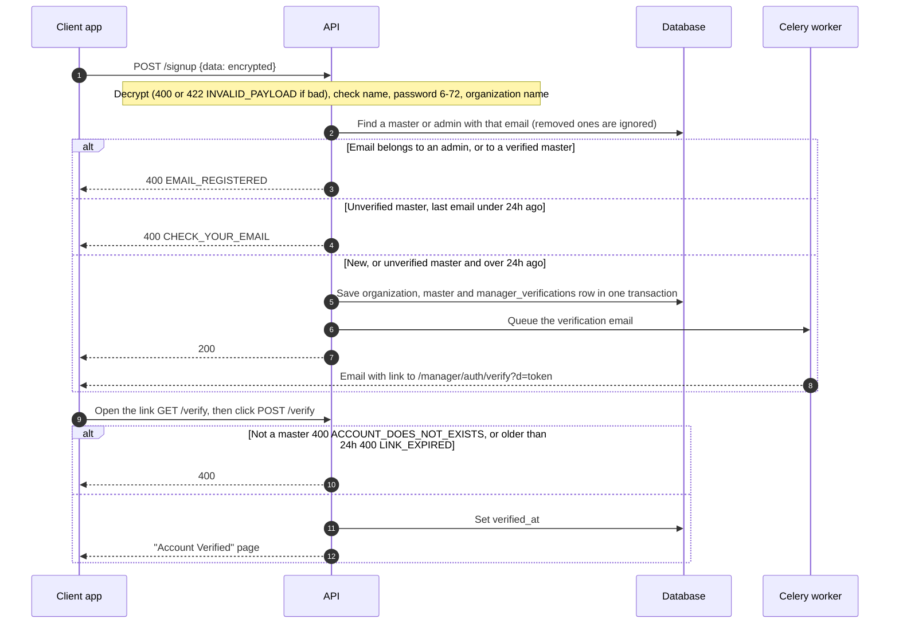
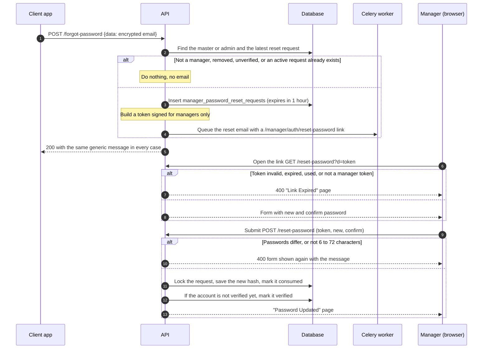
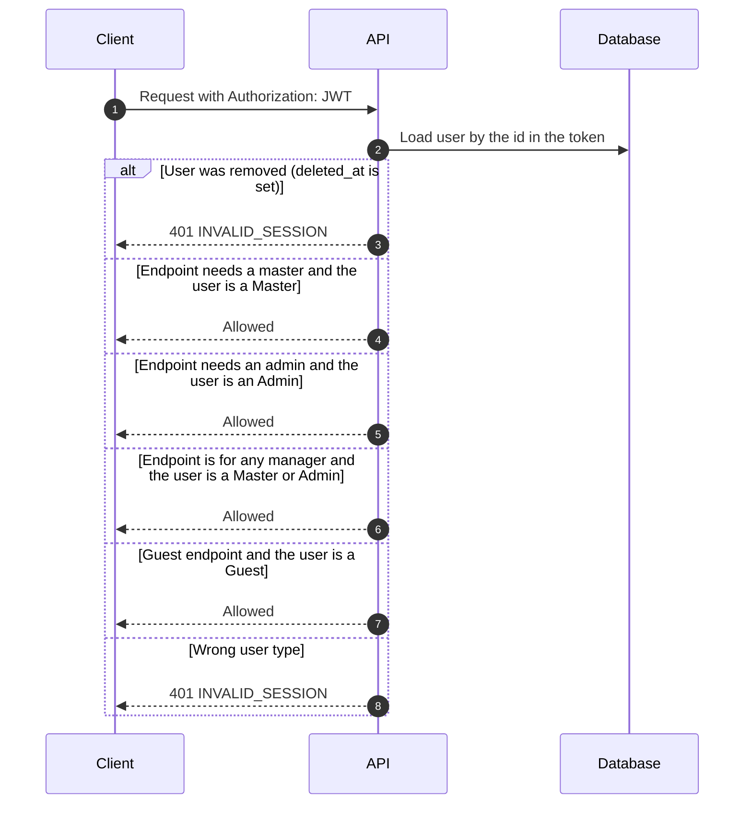

# Manager · Auth

How managers sign up, log in and recover a password. Routes are under `/<STAGE>/api/v1/manager/auth`.

The flow is a copy of the guest one. See [Guest · Auth](../Guest/Auth.md) for encrypted payloads, tokens and emails. Only the differences are here.

## Two roles

| Role | Who | How the account is created | Resorts |
| --- | --- | --- | --- |
| **Master** | The owner. Whoever signs up as a manager, with one resort or many | Signs up | Owns an **organization** that holds all their resorts |
| **Admin** | The person in charge of one resort day to day | **Invited by a master** (see [Manager · Resort](Resort.md#the-admin-of-a-resort)) | Manages exactly **one** resort |

- A master can do everything an admin can. A master also creates resorts, sets their prices and invites the admins. An admin only sees the resort they manage.
- A resort belongs to one master (through the organization) and has zero or one admin. A master can run a resort alone until they invite an admin.
- An admin never signs up. Their email can't be used to sign up as a master.

The database model:

| `user_type` | Model | Extra data |
| --- | --- | --- |
| `master` | `Master` | `organization_id` (unique), name, phone |
| `admin` | `Admin` | `resort_id` (unique, empty once removed), name, phone |

Both share the `users` table, plus `manager_verifications` and `manager_password_reset_requests`, which point at `users.id`.

## 1. Sign up and verify (creates a master)

The decrypted payload is the guest one plus `organization_name`. It is required (1 to 256 characters). A manager with several resorts enters the name of their organization. A manager with one resort enters the name of the resort. The server treats both the same.

## 2. Login (master or admin)

`POST /login` finds the master or admin by email and returns the role, so the client knows which screens to show.

| Field | Master | Admin |
| --- | --- | --- |
| `role` | `"master"` | `"admin"` |
| `organization_id`, `organization_name` | The organization | `null` |
| `resort_id` | `null` | The resort they manage |

Errors: `EMAIL_NOT_EXISTS` (unknown, or the account was removed), `EMAIL_NOT_VERIFIED`, `INVALID_CREDENTIALS`. An admin who was invited but has not set a password yet also gets `INVALID_CREDENTIALS`.

## 3. Forgot and reset password (master or admin)

Same flow as [guest forgot and reset password](../Guest/Auth.md#4-forgot-password), with its own request table, links and tokens, and for both roles. The reset page is the same HTML page, posting to `/manager/auth/reset-password`.

- **Guest and manager reset tokens are not interchangeable.** The token only holds a request id, so each type is signed with its own key (`password_reset` for guests, `manager_password_reset` for managers).
- **Using the link also verifies the email.** The link was sent to the address, so using it proves the address is theirs. This is how an invited admin will get started: the invite link sets their password and verifies them in one step.
- A **removed** manager can't use a link that was sent before they were removed.
- **Reset or invite.** Every link request has a `purpose`: `RESET` (forgot password, lives 1 hour) or `INVITE` (a master invited an admin, lives 7 days). Both open this same page and use the same token. The page says "Set your password" for an invite and "Reset your password" otherwise, and the success page changes the same way. Forgot password only looks at `RESET` requests.

## 4. Who can call what

The dependencies are in `src/core/services/auto_user.py`: `AutoMasterUser`, `AutoAdminUser`, `AutoManagerUser` (a master or an admin, used by logout) and `AutoGuestUser`. A removed user is refused even with a token that has not expired.

## Where things are

| What | Where |
| --- | --- |
| Routes and services | `src/domains/manager/auth/` |
| Find a manager by email | `get_manager_by_email.py` (masters and admins, never removed ones) |
| Manager sign up payload | `src/domains/manager/dtos/sign_up_dto.py` |
| Error names | `src/domains/manager/enums.py` (plus the shared `INVALID_NAME`, `INVALID_PASSWORD_LENGTH`, and `INVALID_PAYLOAD` from `secure_payload_handler.py`) |
| Models | `src/core/models/master.py`, `admin.py`, `organization.py`, `manager_verification.py`, `manager_password_reset_request.py` |
| Reset token | `PasswordResetTokenHandler` (with `MANAGER_PURPOSE`) in `src/core/services/password_reset_token_handler.py` |
| Pages and email | Shared with guest: `reset_password.html`, `password_reset_success.html`, `emails/password_reset_email.html` |
| Tests (need Docker) | `tests/domains/manager/auth/` |

## Not built yet

- Amenities, photos and the availability calendar of a resort (see [Manager · Resort](Resort.md)).
- Moving an admin to another resort. Today it is remove, then invite again.
