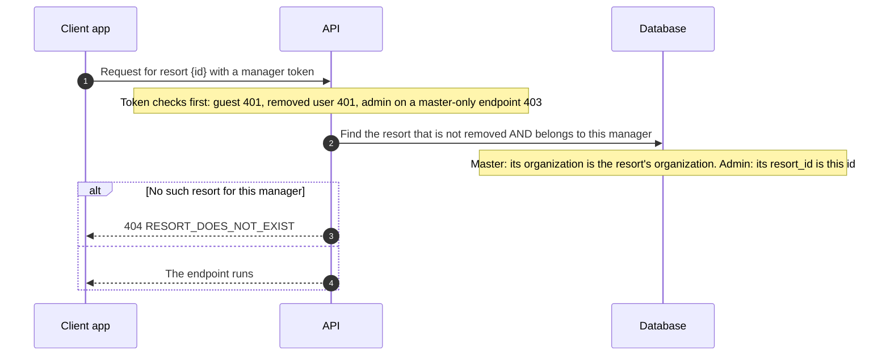
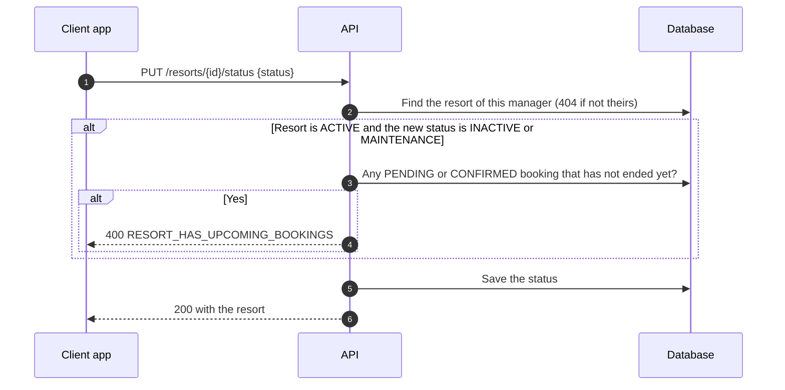

# Manager · Resort

How masters and admins create and manage resorts. Routes are under `/<STAGE>/api/v1/manager/resorts` (see `/docs` for request shapes). Amenities, photos and the availability calendar are not built yet. See [Manager · Auth](Auth.md) for the two roles.

## Who can do what

| Action | Master | Admin |
| --- | --- | --- |
| Create a resort | Yes, in their own organization | No (`403 MASTER_ONLY`) |
| List resorts | All the resorts of the organization | Only the one they manage |
| See one resort | Yes, with its admin's name and email | Yes (prices included, read only) |
| Edit details (name, description, capacity, address, coordinates) | Yes | Yes, their own resort |
| **Change prices** | **Yes** | **No (`403 MASTER_ONLY`)** |
| Change status (`ACTIVE`, `INACTIVE`, `MAINTENANCE`) | Yes | Yes, their own resort |

Every response is the resort in the same shape (`{"resort": {...}}`), so a client always gets the new state back.

## How a resort is reached

Every endpoint that takes a resort id goes through one check, `get_managed_resort`:

A resort that doesn't exist, was removed, or belongs to another master or to a different admin all give the **same 404**, so nobody can discover which resort ids exist.

## Creating a resort

`POST /manager/resorts` (master only).

- The resort is always created in the master's own organization and always starts as a **draft** (`INACTIVE`). The client can't send `organization_id` or `status` (the body rejects unknown fields with a 422).
- Fields: name, description, address, both base prices, currency (`PHP` only), `max_guests`, bedrooms, bathrooms, and optional coordinates.
- A resort name is **unique inside its organization**. Another master can use the same name. The code checks it first and the database enforces it with a unique constraint, so two simultaneous requests can't both succeed.
- Nothing is saved when any rule fails.

| Field | Rule |
| --- | --- |
| `name` | 1 to 256 characters, trimmed |
| `description` | 1 to 5000 characters, trimmed |
| `address` | 1 to 500 characters, trimmed |
| `base_price_per_night`, `base_price_per_day_use` | Above 0, below 10,000,000, at most 4 decimals |
| `max_guests` | 1 to 1000 |
| `num_bedrooms`, `num_bathrooms` | 1 to 100 |
| `latitude`, `longitude` | -90 to 90 and -180 to 180, and both or neither |

## Editing

- **Details** (`PATCH /{id}`): send only the fields to change. An empty body, a `null` for a required field, or any field that isn't listed is a 422. Prices and status can't be changed here. Coordinates can be removed by sending both as `null`. A rename keeps the name rule above.
- **Prices** (`PUT /{id}/pricing`, master only): night price, day-use price and currency. Bookings that already exist keep the price they were made with.
- **Status** (`PUT /{id}/status`, both roles): see below.

## Status and bookings

- A live resort can't be closed while guests still have `PENDING` or `CONFIRMED` bookings that haven't ended. They have to be cancelled or finished first.
- Cancelled, completed and expired bookings, and bookings that already ended, don't count.
- Going from `INACTIVE` to `MAINTENANCE` (or back) and reopening to `ACTIVE` are never blocked.

What the status means for guests:

| Status | In the guest list | Details and reviews | New bookings |
| --- | --- | --- | --- |
| `ACTIVE` | Yes | Yes | Yes |
| `MAINTENANCE` | No | Yes | No |
| `INACTIVE` (draft) | No | No (404, same as a missing resort) | No |

## Where things are

| What | Where |
| --- | --- |
| Routes and services | `src/domains/manager/resort/` |
| "Is this my resort" check | `services/get_managed_resort.py` |
| Response shape | `services/build_resort_detail.py` |
| Field rules shared by create and edit | `services/resort_field_types.py` |
| Name rules and the unique constraint | `services/check_resort_name.py` and `UniqueConstraint` on `Resort` |
| Upcoming bookings check | `services/has_upcoming_bookings.py` |
| Master only / manager only dependencies | `src/core/services/auto_user.py` |
| Tests (need Docker) | `tests/domains/manager/resort/` |

## Not built yet

- Amenities, photos and the availability calendar of a resort.
- Inviting an admin to a resort (see [Manager · Auth](Auth.md#not-built-yet)).
- A resort can be closed (`INACTIVE`) but not deleted.

## Known limitations

- Resort names are compared exactly after trimming, so `Sunrise` and `sunrise` count as different names.
- A resort that was closed while it had no upcoming bookings can still get a booking that was created at the very same moment.
- `PENDING` bookings that are never paid keep blocking the closing of a resort until they are cancelled. Nothing expires them yet.
